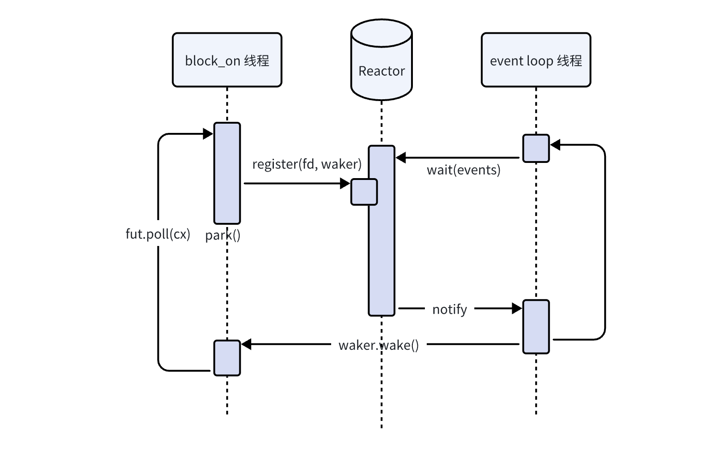

# Reactor的设计

> 参考
>
> * [async-io](https://github.com/smol-rs/async-io)
>
> * [Designing an Async Runtime for WASI 0.2](https://blog.yoshuawuyts.com/building-an-async-runtime-for-wasi/)


我们借助`polling`库，来实现一个reactor，提供统一管理IO的注册、IO事件监听以及唤醒的功能。

基础的设计是：

1. 有一个event loop不断监听注册在Reactor中的IO事件，当IO事件有响应时，调用对应的Waker
2. 被`block_on`求值的IO future，向Reactor注册IO事件（包括waker）



这里`Reactor`最简单提供两个接口，`event_loop`和`register_readable`：

```rust
// Reactor实例
pub struct Reactor {
    // Poller实例
    poller: Poller,
    // 存储
    repo: Mutex<Slab<Arc<IOEvent>>>,
}

// 代表一个IO
struct IOEvent {
    fd: RawFd,
    key: usize,
    is_ready: AtomicBool,
    waker: AtomicWaker,
}


impl Reactor {
    // IO事件循环
    // 当存在fd就绪时，调用注册的waker
    pub fn event_loop(&self) -> io::Result<()>;
    
    // 注册一个可读事件
    // 当fd可读时返回
    pub async fn register_readable(&self, fd: BorrowedFd<'_>) -> io::Result<()>;
}
```


先来看看`event_loop`的实现，其做的事情就是：

1. 等待注册的IO就绪，
2. 调用对应的waker

```rust
pub fn event_loop(&self) -> io::Result<()> {
    let mut events = Events::new();

    loop {
        events.clear();
        // 等待注册到poller的IO就绪
        match self.poller.wait(&mut events, None) {
            Ok(0) => {},
            Ok(_) => {
                let repo = self.repo.lock();
                for ev in events.iter() {
                    // 调用waker
                    if let Some(event) = repo.get(ev.key) {
                        event.waker.take().map(Waker::wake);
                        event.is_ready.swap(true, Ordering::Release);
                    }
                }
                Ok(())
            }
            Err(err) if err.kind() == ErrorKind::Interrupted => {},
            Err(err) => return Err(err),
        }
    }
    
    Ok(())
}
```


然后这里的注册的代码，写为一个异步函数，也方便通过RAII的方式去反注册：

```rust
 // 注册可读fd，直到fd就绪
pub async fn register_readable(&self, fd: BorrowedFd<'_>) -> io::Result<()> {
    // IO RAII
    struct IOGuard<'r> {
        reactor: &'r Reactor,
        event: Arc<IOEvent>,
    }

    impl<'r> IOGuard<'r> {
        // 构造FdGuard，并将fd注册到reactor中
        fn new(reactor: &'r Reactor, fd: BorrowedFd<'_>) -> io::Result<Self> {
            let event = {
                let mut repo = reactor.repo.lock();
                let entry = repo.vacant_entry();
                let event = Arc::new(IOEvent {
                    fd: fd.as_raw_fd(),
                    key: entry.key(),
                    is_ready: AtomicBool::new(false),
                    waker: AtomicWaker::new(),
                });

                entry.insert(event.clone());
                event
            };

            // fd注册到poller里
            if let Err(err) =
                unsafe { reactor.poller.add(event.fd, Event::readable(event.key)) }
            {
                let mut repo = reactor.repo.lock();
                repo.remove(event.key);
                return Err(err);
            }

            Ok(Self { reactor, event })
        }
    }

    // 当完成或者取消时自动反注册
    impl Drop for IOGuard<'_> {
        fn drop(&mut self) {
            let mut repo = self.reactor.repo.lock();
            repo.remove(self.event.key);
            self.reactor
                .poller
                .delete(unsafe { BorrowedFd::borrow_raw(self.event.fd) })
                .ok();
        }
    }

    let io_guard = IOGuard::new(self, fd)?;

    poll_fn(|cx| {
        let event = &*io_guard.event;
        // 等待reactor唤醒并改变状态
        if event.is_ready.load(Ordering::Acquire) {
            return Poll::Ready(Ok(()));
        }

        // 每次poll别忘记更新waker
        event.waker.register(cx.waker());

        Poll::Pending
    })
    .await
}
```


这个`register_readable`是用于IO future的实现的，这里仍然以stdin为例子：

```rust
// 异步的stdin
pub struct Stdin<'r> {
    reactor: &'r Reactor,
    stdin: io::Stdin,
}

impl<'r> Stdin<'r> {
    pub fn new(reactor: &'r Reactor) -> io::Result<Self> {
        let this = Self {
            reactor,
            stdin: io::stdin(),
        };
        // 设置为异步的IO，
        // 之后阻塞时通过Read::read返回的错误码为WouldBlock
        rustix::io::ioctl_fionbio(&this.stdin, true)?;

        Ok(this)
    }

    pub async fn read(&self, buf: &mut [u8]) -> io::Result<usize> {
        loop {
            // 尝试读stdin
            match self.stdin.lock().read(buf) {
                Err(err) if err.kind() == io::ErrorKind::WouldBlock => {}
                res => return res,
            }
            // 如果被阻塞则等待stdin就绪
            self.reactor.register_readable(self.stdin.as_fd()).await?;
        }
    }
}

```


有了`Reactor`，我们就可以单独跑一个线程来管理多个IO的注册与唤醒了，到这里才能体现出异步在IO密集的应用上的优势。虽然和前面的stdin实现都创建了一个额外的线程处理IO事件，但这里可以同时处理多个不同类型的IO，实现了所谓的IO的“复用”。

```rust
let reactor = Reactor::new();

thread::scoped(|s| {
    // reactor io线程，用于处理IO事件
    s.spawn(|| reactor.event_loop().unwrap());
    
    // 其它线程拿到Reactor可以用于创建IO对象
    s.spawn(|| {
        block_on(async {
            let mut buf = [0; 1000];
            let mut buf = &mut buf[..];
            let stdin = Stdin::new(reactor)?;

            while buf.len() > 0 {
                let x = stdin.read(buf).await?;
                println!("from stdin: {:?}", String::from_utf8_lossy(&buf[..x]));

                buf = &mut buf[x..];
                yield_now().await;
                
                println!("yielding");
            }

            println!("end");
            Ok(())
        })
    });
});
```


> 注：其实reactor的事件循环可以和block_on的轮询集成到一个循环里，这样甚至不需要多开一个线程。通过向reactor里注册一个特定的fd，在waker里进行IO操作，可以唤醒reactor。

