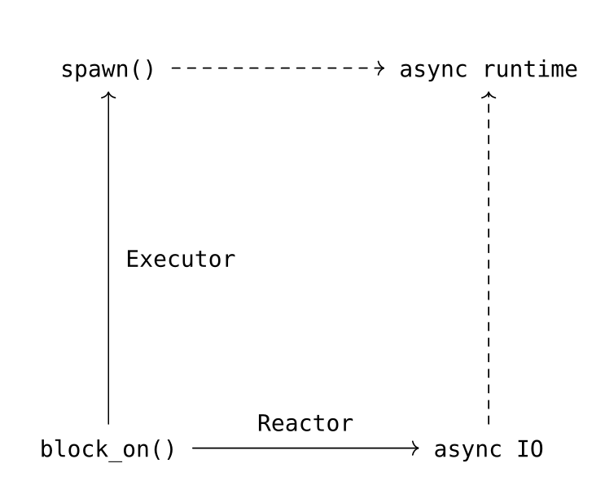

# 结论

至此，我们已经获得了一个功能相对完整的异步运行时了。这里将异步运行时打碎成`block_on`, `Reactor`, `Executor`三个最基础的组件，其实我们已经拥有了几乎没有上限的定制运行时的能力，我们完全可以控制Future的执行时机，可以拥有什么权限等等。

可惜，现在tokio当道，tokio则几乎没有定制的能力，作为使用者没法拒绝得了tokio全家桶，哎。

最后画一个图来总结下

1. 异步运行时最基础的一个功能是`block_on()`，对一个`Future`进行求值，其最简单实现就是对`Future`进行轮询`poll`。
2. 我们通过引入一个`Reactor`（一个IO的event loop），获得了异步IO的能力，比如文件读写、Timer等。
3. 然后我们再加入一个`Executor`时（利用多线程对Task进行调度），我们就获得了多线程并发的能力，也就是`spawn()`接口。
4. 同时有了`block_on()`, `Executor`和`Reactor`之后，我们就能获得一个功能相对完整的异步运行时。（当然，不一定要有`Executor`和`Reactor`这两个抽象，tokio就是将两者合二为一）

